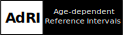
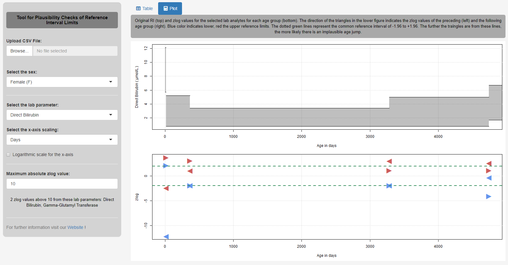

# Shiny App for Plausibility Checks of Reference Interval Limits!



This Shiny App computes the zlog values of the preceding and the subsequent reference interval for different analytes for each age group. Many medical reference intervals are not age-dependent and have large jumps between the individual age groups. This should be prevented by considering the zlog value. The lower reference limits (LL) and upper reference limits (UL) can transform any result x into a zlog value using the following equation: 


If the zlog value deviates significantly from -1.96 to 1.96, the reference intervals and the age groups should possibly be renewed to obtain age-dependent reference intervals!
<p>&nbsp</p>


## Installation 

**Method 1:**
Download the Zip-File this Shiny App. Unzip the file and set your working direction to the path of the folder. 
The package [shiny](https://cran.r-project.org/web/packages/shiny/index.html) (≥ 1.4.0) must be installed before using the Shiny App:

```bash
# Test if shiny is installed:
if("shiny" %in% rownames(installed.packages())){
  library(shiny)} else{install.packages("shiny")}
```
And then start the app with the following code:
```bash
runApp("app.R")
```
**Method 2:**
Use the function ```runGitHub()``` from the package [shiny](https://cran.r-project.org/web/packages/shiny/index.html):

```bash
library(shiny)
runGitHub("Zlog_AdRI", "SandraKla")
```

The package [DT](https://cran.r-project.org/web/packages/DT/index.html) (≥ 0.13) is downloaded or imported when starting this app. The used [R](https://www.r-project.org)-Version must be ≥ 3.6.1.

## Data

### Preloaded dataset
The CALIPER-Dataset with age-dependent reference intervals has been preloaded into this Shiny App. For this purpose, the data was brought into the appropriate shape for the analysis from the [Supplemental Table](https://academic.oup.com/clinchem/article/58/5/854/5620695#supplementary-data) from the publication: *Age-Specific and Sex-Specific Pediatric Reference Intervals for 40 Biochemical Markers*. 

### New data
For new data use the [CALIPER-Dataset](https://github.com/SandraKla/Zlog_AdRI/blob/master/data/CALIPER.csv) as template with the columns: 

* **CODE**: Name of the analyte ("Calcium") 
* **LABUNIT**: Unit of the analyte ("mmol/L")
* **SEX**: "M" for male, "F" for female and "AL" for male and female together
* **UNIT**: Unit of the age range in "year", "month", "week" or "day"
* **AgeFrom**: Start of the age range 
* **AgeUntil**: End of the age range 
* **LowerLimit**: Start of the reference interval (LL)
* **UpperLimit**: Start of the reference interval (UL)

The data must be in CSV-format (sep = "," and dec = ".").

## Contact

Please contact me under the email address _sandrakla97@web.de_ if you have any questions or problems. For more informations use the [Homepage](https://sandrakla.github.io/Zlog_AdRI/)! 

*Link to the publication: A Tool for Plausibility Checks of Reference Interval Limits*
