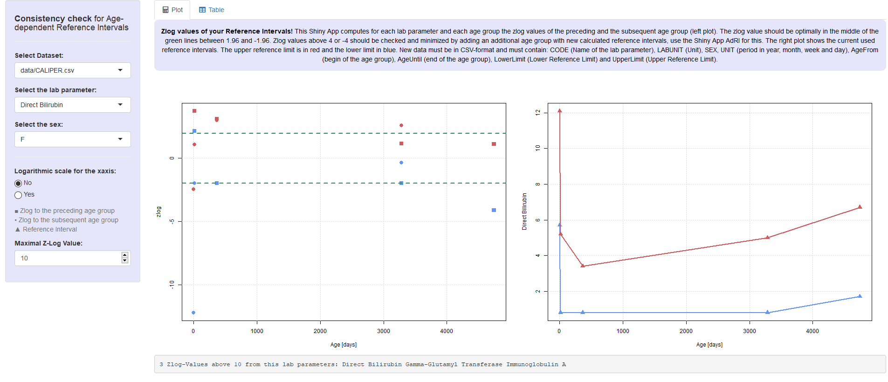

# Zlog_AdRI


**Shiny App for Consistency check for age-dependent reference intervals!**

This Shiny App computes the zlog values of the preceding and the subsequent reference interval for different analytes for each age group, see the [Wiki](https://github.com/SandraKla/Zlog_AdRI/wiki). 



## Installation 

Download the Zip-File from this Shiny App and set your working direction to this path and run:

```bash
# Test if shiny is installed:
if("shiny" %in% rownames(installed.packages())){
  library(shiny)} else{
  install.packages("shiny")}
```

```bash
library(shiny)
runApp("app.R")
```
Or use the function ```runGitHub()``` from the package *shiny*:

```bash
library(shiny)
runGitHub("Zlog_AdRI", "SandraKla")
```

All required packages are downloaded when starting this app or imported if they already exist. For more information about the required packages use the [Wiki](https://github.com/SandraKla/Zlog_AdRI/wiki).
