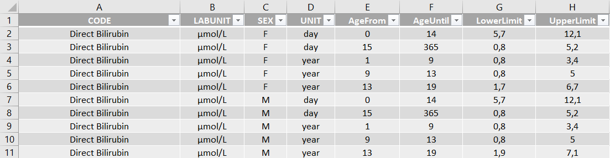
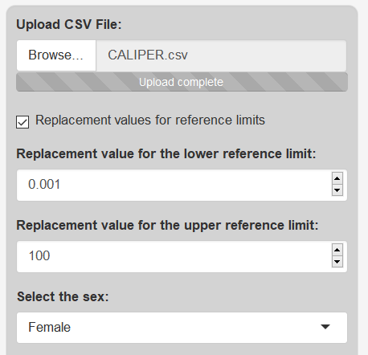
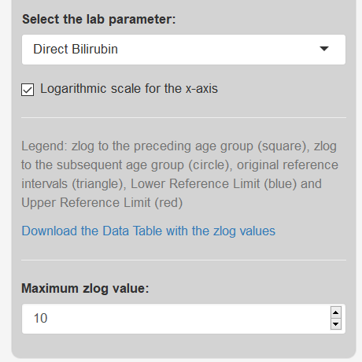
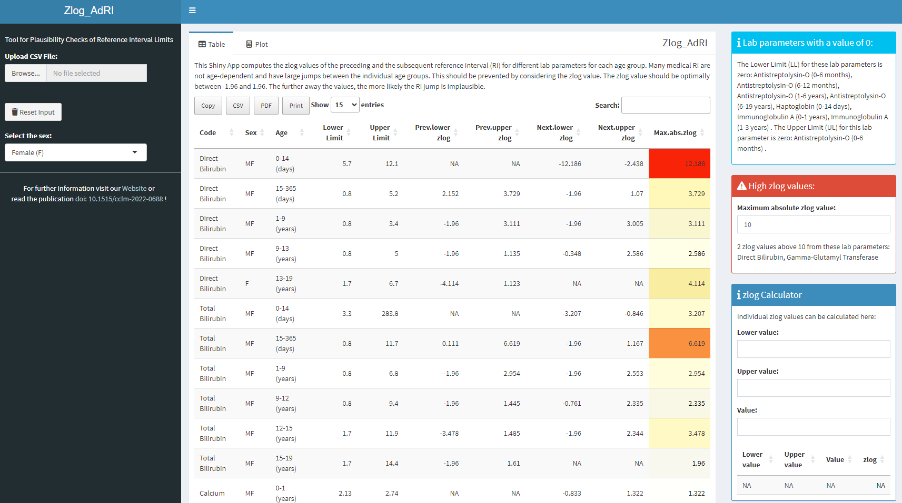

* [Home](./index.md)
* [Installation](./install.md)
* [Guide](./guide.md)
* [About](./about.md)

## CALIPER-Dataset

The [CALIPER](https://caliper.research.sickkids.ca/#/) dataset with age-dependent reference intervals has been loaded into this Shiny App. For this purpose, the data was brought into the appropriate shape for the analysis from the [supplemental table 2](https://academic.oup.com/clinchem/article/58/5/854/5620695#supplementary-data) from Age-Specific and Sex-Specific Pediatric Reference Intervals for 40 Biochemical Markers.

## Load new data 

For new data use the [template](https://github.com/SandraKla/Zlog_AdRI/blob/master/data/CALIPER.csv) with the columns:

* **CODE**: Name of the analyte ("Calcium") 
* **LABUNIT**: Unit of the analyte ("mmol/L")
* **SEX**: "M" for male and "F" for female
* **UNIT**: Unit of the age range in "year", "month", "week" or "day"
* **AgeFrom**: Start of the age range 
* **AgeUntil**: End of the age range 
* **LowerLimit**: Start of the reference interval (LL)
* **UpperLimit** Start of the reference interval (UL)

The data must be in CSV-format.

## Guide
### Step 1) Settings

If the lower reference limit is zero, it will be set to 0.001 (in the table in red) and the upper reference limit to 100 (in the table in blue) or by the given replacement reference values!

  
  

### Step 2) Table

With the help of the table, find high zlog values and the appropriate laboratory parameters. These can be visualized in step 3. The data can be downloaded in CSV-format.

### Step 3) Plot 

This Shiny App computes for each lab parameter and each age group the zlog values of the preceding and the subsequent age group. This shows the left plot. The zlog value should be optimally in the middle of the green lines between 1.96 and -1.96. Zlog values above 4 or -4 should be checked and minimized by adding an additional age group with new calculated reference intervals. The right plot shows the current used reference intervals. The upper reference limit is in red and the lower limit in blue. 

  Legend:  

* ■ Zlog to the preceding age group
* • Zlog to the subsequent age group
* ▲ stands for the reference intervals

