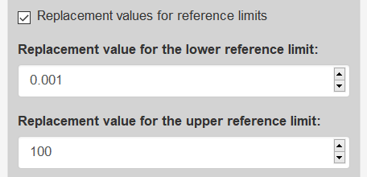

* [Home](./index.md)
* [Installation](./install.md)
* [Guide](./guide.md)
* [About](./about.md)

---

### Load new data 

For new data use the [CALIPER-Dataset](https://github.com/SandraKla/Zlog_AdRI/blob/master/data/CALIPER.csv) as template with the columns:

* **CODE**: Name of the analyte ("Calcium") 
* **LABUNIT**: Unit of the analyte ("mmol/L")
* **SEX**: "M" for male and "F" for female
* **UNIT**: Unit of the age range in "year", "month", "week" or "day"
* **AgeFrom**: Start of the age range 
* **AgeUntil**: End of the age range 
* **LowerLimit**: Start of the reference interval (LL)
* **UpperLimit**: Start of the reference interval (UL)

The data must be in CSV-format (sep = "," and dec = ".").

### Settings

1)	Upload the CSV File with own reference intervals 

2)	Replacement values: If the lower reference limit is zero, it will be set to 0.001 and the upper reference limit to 100 or by own given reference limits.

3)	Select the sex

4)	Select the lab parameter

5)	Select if the x-axis should be logarithmic

6)	Select the maximum zlog value for quick determination of very high zlog values

7)	Download the data with the zlog values (only when opened in the browser)

### Table with zlog values

The table shows the zlog values. Zlog values under -1.96 are in blue and above 1.96 in orange/red. The zlog value should be optimally between 1.96 and -1.96 in white.

The table shows following informations:

- Prev.lower zlog = zlog value to previous lower limit 
- Prev.upper zlog = zlog value to previous upper limit
- Next.lower zlog = zlog value to next lower limit
- Next.upper zlog = zlog value to next upper limit
- Max zlog = maximum zlog value of this entry

### Plot with zlog values 

This Shiny App computes for each lab parameter and each age group the zlog values of the preceding and the subsequent age group. The first plot shows the currently used reference intervals. The upper reference limit is in red and the lower limit in blue. The second plot shows for the selected lab parameter and each age group the zlog values of the preceding and the subsequent age group (Legend: zlog to the preceding age group (square), zlog to the subsequent age group (circle)). The zlog values should be optimally in the middle of the green lines between 1.96 and -1.96.

