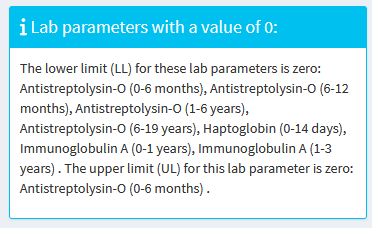
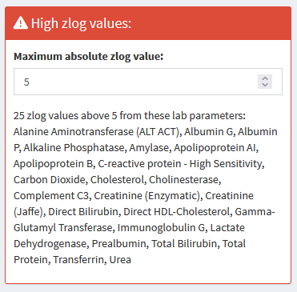

[Home](./index.md) - [Installation](./install.md) - [Guide](./guide.md) - [About](./about.md)

---

### Load new data 

For new data use the [CALIPER-Dataset](https://github.com/SandraKla/Zlog_AdRI/blob/master/data/CALIPER.csv) as template with the columns:

* **CODE**: Name of the analyte ("Calcium") 
* **LABUNIT**: Unit of the analyte ("mmol/L")
* **SEX**: "M" for male, "F" for female and "MF" for both
* **UNIT**: Unit of the age range in "year", "month", "week" or "day"
* **AgeFrom**: Start of the age range 
* **AgeUntil**: End of the age range 
* **LowerLimit**: Start of the reference interval (LL)
* **UpperLimit**: Start of the reference interval (UL)

If information about the lower or upper limit is missing, the info is displayed and the values can be added to the dataset (if available) and reloaded into this Shiny App. The lower limit is set to NA if it is zero. When the upper value is missing, the datapoints is then not considered in the calculation.

### Settings

1)	Upload the CSV File with own reference intervals. 

2)	Select the sex

3)	In Plot: Select the lab parameter

4)	In Plot: Select which x-axis scaling should be displayed and if this should be logarithmic

5)	Select the maximum zlog value for quick determination of very high zlog values (Example with the preloaded CALIPER-Dataset)

 

### Table with zlog values

The table shows the zlog values. Max. abs. zlog values above 1.96 are in orange/red. The zlog value should be optimally between 1.96 and -1.96.The table shows following information:

- _Prev.lower zlog_ = zlog value to previous lower limit 
- _Prev.upper zlog_ = zlog value to previous upper limit
- _Next.lower zlog_ = zlog value to next lower limit
- _Next.upper zlog_ = zlog value to next upper limit
- _Max. abs. zlog_ = Absolute maximum zlog value of this reference interval

### Plot with zlog values 

This Shiny App computes for each lab parameter and each age group the zlog values of the preceding and the subsequent age group. The first plot shows the currently used reference intervals. The upper reference limit is in red and the lower limit in blue. The second plot shows for the selected lab parameter and each age group the zlog values of the preceding and the subsequent age group (Legend: zlog to the preceding age group (Triangle with the point to the right), zlog to the subsequent age group (preceding)). The zlog values should be optimally in the middle of the green lines between 1.96 and -1.96.

