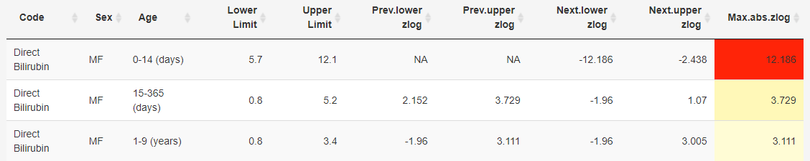

[Home](./index.md) - [Installation](./install.md) - [Guide](./guide.md) - [About](./about.md)

---

This Shiny App computes the zlog values of the preceding and the subsequent reference interval for different analytes for each age group. Many medical reference intervals are not age-dependent and have large jumps between the individual age groups. This should be prevented by considering the zlog value. The lower reference limits (LL) and upper reference limits (UL) can transform any result x into a zlog value using the following equation: 

zlog(x) = (log(x)–(log(LL)+ log(UL))/2)*3.92/(log(UL)–log(LL))

If the zlog value deviates significantly from -1.96 to 1.96, the reference intervals and the age groups should possibly be renewed to obtain age-dependent reference intervals.

Link to the publication: *A zlog-based algorithm and tool for plausibility checks of reference intervals*
