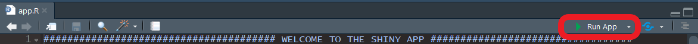

[Home](./index.md) - [Installation](./install.md) - [Guide](./guide.md) - [About](./about.md)

---

## Installation 

**Method 1:**
Use the function ```runGitHub()``` from the package [shiny](https://cran.r-project.org/web/packages/shiny/index.html):

```bash
if("shiny" %in% rownames(installed.packages())){
  library(shiny)} else{install.packages("shiny")
  library(shiny)}
runGitHub("Zlog_AdRI", "SandraKla")
```

**Method 2** (not recommended):
Download the Zip-File from this Shiny App. Unzip the file and set your working direction to the path of the folder. 
The package [shiny](https://cran.r-project.org/web/packages/shiny/index.html) (≥ 1.7.1) must be installed before using the Shiny App:

```bash
# Test if shiny is installed:
if("shiny" %in% rownames(installed.packages())){
  library(shiny)} else{install.packages("shiny")
  library(shiny)}
```
And then start the app with the following code:
```bash
runApp("app.R")
```

In RStudio with installed [shiny](https://cran.r-project.org/web/packages/shiny/index.html) use the Run App-Button when opening the zlog project:

<p float="left">
  
</p>

The package [DT](https://cran.r-project.org/web/packages/DT/index.html) (≥ 0.21) and [shinydashboard](https://cran.r-project.org/web/packages/shinydashboard/index.html) (≥ 0.7.2) is downloaded or imported when starting this app. The used [R](https://www.r-project.org)-Version must be ≥ 4.1.2 (2021-11-01).

## CALIPER-Dataset

Data from the [CALIPER-Database](https://caliper.research.sickkids.ca/#/) with age-dependent reference intervals has been preloaded into this Shiny App. For this purpose, the data was brought into the appropriate shape for the analysis from the [Supplemental Table 2](https://academic.oup.com/clinchem/article/58/5/854/5620695#supplementary-data) from the publication: *Closing the Gaps in Pediatric Laboratory Reference Intervals: A CALIPER Database of 40 Biochemical Markers in a Healthy and Multiethnic Population of Children*. 
